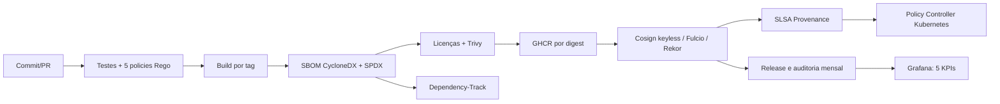

# API Pagamentos — compliance contínuo

Projeto integrador que transforma uma API Node.js mínima em uma cadeia de entrega verificável. Um pull request executa testes da aplicação, 15 testes de cinco policies Rego, build/scan do container e validação do SBOM. Uma tag `v*` publica a imagem no GHCR por digest, gera SBOM CycloneDX e SPDX, aplica a allowlist de licenças, bloqueia vulnerabilidades altas/críticas, assina com Cosign keyless/OIDC, anexa atestações e produz SLSA Provenance. O admission controller recusa imagens que não satisfaçam assinatura, identidade, SBOM e provenance.

## Arquitetura e decisões



- A aplicação não usa dependências de produção. Isso reduz a superfície de ataque, mas o pipeline continua enumerando sistema operacional, runtime e dependências transitivas da imagem.
- O artefato é promovido pelo digest imutável; tags servem apenas para descoberta.
- A identidade aceita é limitada ao workflow `release.yml` deste repositório, emitida pelo OIDC do GitHub Actions. Não há chave de longa duração.
- O gerador oficial SLSA em workflow reutilizável separa a provenance do job de build e identifica o builder.
- Evidências são anexadas ao GitHub Release e às atestações no registry. Releases e transparency log formam a trilha imutável/simulada.
- A política de licenças é allowlist: licenças desconhecidas falham de forma segura.
- O Dependency-Track opera de verdade quando os secrets existem e retorna um recibo determinístico de mock quando não existem.

## Estrutura

| Diretório/arquivo | Responsabilidade |
|---|---|
| `.github/workflows/verify.yml` | Gates de PR: aplicação, Rego, SBOM, Trivy e lint |
| `.github/workflows/release.yml` | Build, SBOMs, licenças, assinatura, atestações, SLSA e release |
| `.github/workflows/monthly-audit.yml` | Auditoria mensal automatizada |
| `policies/rego/` e `policies/tests/` | Cinco controles e testes positivos/negativos |
| `k8s/` | Workload hardened, namespace restricted e `ClusterImagePolicy` bloqueante |
| `scripts/` | Submissão ao Dependency-Track e relatório mensal |
| `monitoring/` | Grafana/Prometheus reproduzível com cinco KPIs |
| `evidencias/` | Saídas demonstrativas versionadas; evidência real nasce no pipeline |
| `APRESENTACAO.md` | Roteiro cronometrado para a banca |

## Execução local

Pré-requisitos: Node.js 20+, OPA 0.68+, `jq`, Python 3 e Bash. Docker é necessário apenas para container/dashboard.

```bash
npm ci
make test
make validate
docker build -t api-pagamentos:local .
docker run --rm -p 3000:3000 api-pagamentos:local
curl http://localhost:3000/health
```

Os testes Rego podem ser executados isoladamente:

```bash
opa test --format=pretty policies/
```

As cinco policies são: baseline da imagem, allowlist de licenças, integridade do SBOM, SLSA Provenance e hardening Kubernetes. Cada módulo tem casos válidos e adversariais.

## Configuração do GitHub e release

1. Crie o repositório e habilite GitHub Actions e GitHub Packages.
2. Mantenha as permissões padrão restritas; cada job declara somente as permissões necessárias.
3. Para Dependency-Track real, cadastre `DEPENDENCY_TRACK_URL` e `DEPENDENCY_TRACK_API_KEY`. Sem ambos, o job registra `mode=mock` e ainda deixa evidência.
4. Troque `OWNER` em `k8s/policy-controller-policy.yaml`, `k8s/deployment.yaml` e `k8s/demo-unsigned.yaml` pelo owner real.
5. Faça push de uma tag semântica:

```bash
git tag v1.0.0
git push origin v1.0.0
```

O workflow cria o release sem aprovação manual. Seus assets são `sbom.cdx.json`, `sbom.spdx.json`, `license-analysis.json`, `trivy.json` e `dependency-track.log`. A imagem e todas as verificações usam o digest produzido pelo build.

Verificação independente (substitua os valores):

```bash
export TARGET='ghcr.io/OWNER/api-pagamentos@sha256:DIGEST'
export IDENTITY='https://github.com/OWNER/api-pagamentos/.github/workflows/release.yml@refs/tags/v1.0.0'
cosign verify "$TARGET" --certificate-identity "$IDENTITY" --certificate-oidc-issuer https://token.actions.githubusercontent.com
cosign verify-attestation "$TARGET" --type cyclonedx --certificate-identity "$IDENTITY" --certificate-oidc-issuer https://token.actions.githubusercontent.com
cosign verify-attestation "$TARGET" --type slsaprovenance --certificate-identity-regexp '^https://github.com/slsa-framework/slsa-github-generator/' --certificate-oidc-issuer https://token.actions.githubusercontent.com
```

## Gate de admissão

Instale o Sigstore Policy Controller no cluster conforme a documentação da distribuição e aplique os manifests depois de substituir `OWNER`:

```bash
kubectl apply -f k8s/namespace.yaml
kubectl apply -f k8s/policy-controller-policy.yaml
kubectl apply -f k8s/deployment.yaml
```

Teste adversarial obrigatório:

```bash
kubectl apply -f k8s/demo-unsigned.yaml
```

A requisição deve falhar no admission webhook com `no matching signatures`. O policy controller também exige atestações CycloneDX e SLSA. Capture a saída real para a banca; o arquivo `evidencias/admission-denied-exemplo.txt` documenta o formato esperado, não se apresenta como execução real.

## Dependency-Track, auditoria e dashboard

Submissão mockada local (qualquer SBOM CycloneDX válido):

```bash
python3 scripts/consulta_dt.py submit sbom.cdx.json
```

Auditoria reproduzível sem GitHub/registry:

```bash
RELEASE_FIXTURE=evidencias/releases-exemplo.json REPORT_MONTH=2026-07 scripts/gera_relatorio.sh
scripts/test_relatorio.sh
```

Sem `RELEASE_FIXTURE`, o script consulta releases com `gh` e verifica assinatura, provenance e SBOM com Cosign. O workflow agendado roda no primeiro dia do mês e guarda o relatório por 90 dias.

Dashboard local:

```bash
make demo-dashboard
# abrir http://localhost:3001/d/api-pagamentos-compliance
```

Os cinco KPIs são taxa de releases conformes, imagens assinadas, cobertura de SBOM, testes de policy aprovados e vulnerabilidades críticas. `evidencias/dashboard-exemplo.svg` é uma visão de exemplo; o JSON provisionado contém consultas PromQL funcionais.

## Mapeamento para frameworks

| Controle implementado | NIST SSDF 1.1 | SLSA v1.0 | ISO/IEC 27001:2022 |
|---|---|---|---|
| Branch gates e policies Rego testadas | PO.3, PS.1, PW.8 | Build L1: processo documentado | A.5.8, A.8.25, A.8.29 |
| Build automatizado, isolado e por digest | PW.6, PS.2 | Build L2/L3: hosted build e provenance | A.8.25, A.8.31 |
| SBOM CycloneDX/SPDX e Dependency-Track | PS.3, RV.1 | Distribuição de metadados | A.5.19, A.5.21, A.8.8 |
| Allowlist de licenças e scan Trivy | PW.4, PW.7, RV.1 | Dependências declaradas | A.5.21, A.8.8, A.8.30 |
| Cosign keyless, Fulcio e Rekor | PS.2, PS.3 | Provenance autenticada | A.5.15, A.8.24, A.8.25 |
| SLSA Provenance com builder identificado | PS.2, PS.3 | Build L3 (gerador SLSA) | A.8.15, A.8.25 |
| Admission bloqueia artefato não assinado | PS.1, PW.9 | Verificação antes do uso | A.8.19, A.8.25, A.8.31 |
| Releases, atestações e relatório mensal | PO.3, PS.3, RV.2 | Evidência verificável | A.5.28, A.8.15, A.8.16 |

O nível SLSA efetivo depende da execução hospedada e da configuração do repositório; o código prepara o gerador para provenance de container, mas não reivindica nível com base apenas nos arquivos locais.

## Limites e evidência honesta

Este checkout não contém credenciais, registry nem cluster. Portanto, assinatura OIDC, transparency log e bloqueio de admission só podem ser comprovados numa execução GitHub/cluster real. Os arquivos de exemplo são claramente identificados; os workflows produzem os artefatos reais necessários para substituir as amostras.
